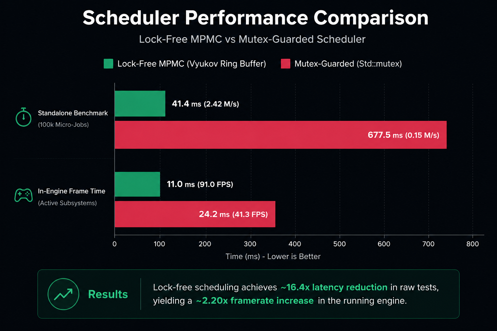

# FYNiX

FYNiX is a modular, custom C++ game engine built using OpenGL, integrating real-time rendering, skeletal animation, physics, and a custom multithreaded job scheduler.

Originally started as a 10-day challenge, it has evolved into a long-term learning project to explore low-level game engine architecture and systems engineering.

---

## ⚡ Core Systems

- **Real-Time Rendering**: Custom OpenGL rendering pipeline featuring phong lighting, dynamic particle emitters, and debug visualizers.
- **Skeletal Animation**: Hierarchical transform propagation, rigged glTF asset support, and quaternion-based skeletal animation blending.
- **Multithreaded Scheduler**: Low-latency thread pool utilizing lock-free concurrent MPMC queues and cooperative scheduling to parallelize workloads.
- **Subsystem Parallelization**: Worker thread-driven execution pipelines for Bullet physics simulation steps, particles, and animation.
- **Editor Tooling & Persistence**: Interactive scene hierarchy manipulation via Dear ImGui, with full world serialization using a custom `.fynx` format.
- **Asynchronous Asset Pipeline**: Decoupled CPU file loading (Assimp glTF & image parsing) on background threads with main-thread GPU synchronization.

---

## 🛠️ Tech Stack

- **Core / Math**: C++17, GLM
- **Rendering / Windowing**: OpenGL 3.3, GLFW, GLAD
- **Physics / Collision**: Bullet Physics
- **Asset Loading**: Assimp, stb_image
- **Editor UI**: Dear ImGui

## 📈 Performance

A comparison of task dispatch latency when scheduling 100,000 concurrent micro-jobs under heavy thread contention:

---

## 🚧 Status

Actively developed to explore low-level engine architecture. Includes a profiler overlay to monitor queue depth, scheduler metrics, and subsystem performance in real-time.

